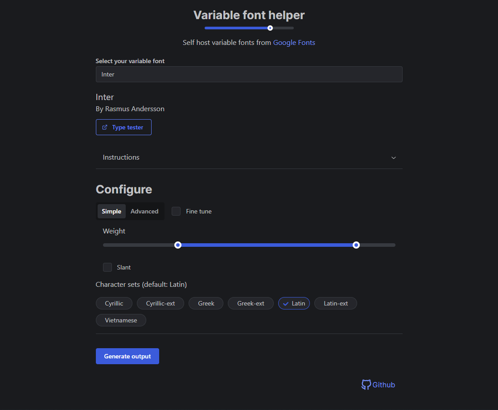

# Variable fonts helper

### Self host variable fonts from Google Fonts

### <https://variable-font-helper.web.app>

## Stack:
* React
* [Mantine UI](https://mantine.dev)
* Firebase Cloud Functions
* Firebase Hosting

## How it works

1. Client will make a request to <https://us-central1-variable-font-helper.cloudfunctions.net/getMetadata> which will execute a Firebase Cloud Function.
2. The Cloud Function will make a request to <https://fonts.google.com/metadata/fonts>, filter the output and cache the response for 1 day.
3. When `Generate Output` is pressed, the client will send a request to the [Google Fonts CSS2 API](https://developers.google.com/fonts/docs/css2#api_url_specification) and extract the font url and stylesheet from each subset using a regexp.
4. Clicking `Download All` will `fetch` all selected subsets and turn them into a zip archive using [jsZip](https://www.npmjs.com/package/jszip) in-browser.

## Run locally

1. Install firebase-tools

`pnpm add -g firebase-tools`

2. Run the client & functions locally

`pnpm --recursive dev`
